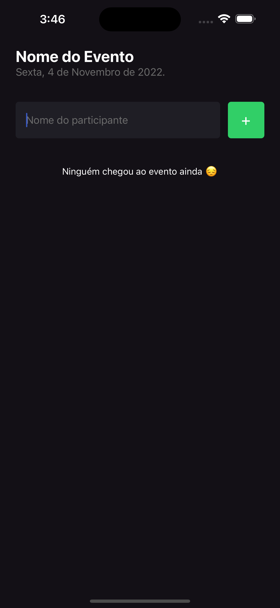

<h1 align="center">
    <a href="https://pt-br.reactjs.org/">Imhere</a>
</h1>

🚀 Projeto 01 do curso da rocketseat - trilha 2022.
App para cadastro de participantes em eventos

<h1 align="center">
  
  <video width="250" height="524" controls>
    <source src="./.github/imhere-video.mp4" type="video/mp4">
  </video>
</h1>

### Features

- [x] FlatList
- [x] Alert
- [x] Text
- [x] StyleSheet
- [x] TouchableOpacity

### 🛠 Tecnologias

As seguintes ferramentas foram usadas na construção do projeto:

- [Expo](https://expo.io/)
- [Node.js](https://nodejs.org/en/)
- [React](https://pt-br.reactjs.org/)
- [React Native](https://reactnative.dev/)
- [TypeScript](https://www.typescriptlang.org/)
